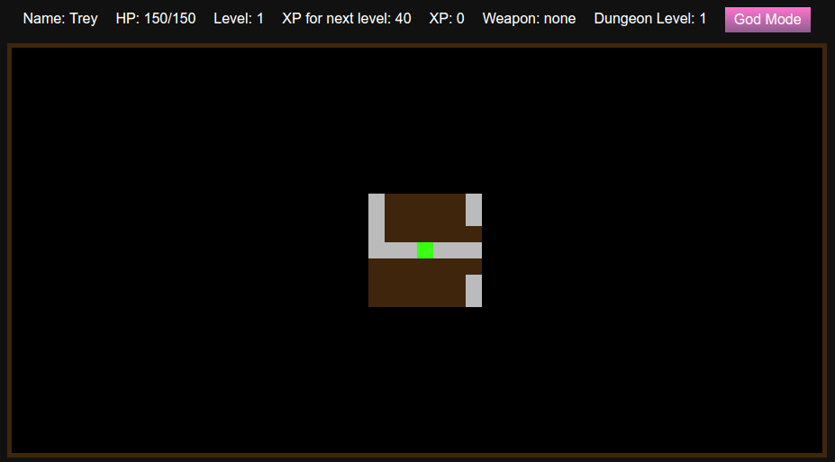

# Roguelike Dungeon Crawler Game

## Description

This is an implementation of a [roguelike](https://en.wikipedia.org/wiki/Roguelike) [dungeon crawler](https://en.wikipedia.org/wiki/Dungeon_crawl) which is subgenre to a role-playing game where the player goes through a series of randomly generated mazes to fight monsters and collect and use helpful items to advance to eventually fight and defeat a final boss.

The game is in 2D and uses a tile-based format where each space in the dungeon may contain one of the following:

 * the hero (user)
 * monster
 * weapon
 * potion

The game is also turn-based, meaning time progresses after each discrete move a user makes. For example, standing next to a monster and not moving doesn't engage the monster nor does the monster engage you. Advancing into the tile where the monster is will start combat and both monster and character will trade damage for one turn. The user must keep advancing into the tile to defeat the monster. If the monster is defeated, then it will be destroyed and the space opens up for the character to occupy.

## Live Demo

https://coymeetsworld.github.io/dungeon-crawler

  

## Instructions

There are 4 levels to progress through in this version of the game. As you advance through levels the monsters get tougher to beat and the final level will have the strongest monster (the boss). However, as the character defeats monsters a proportional amount of [experience points](https://en.wikipedia.org/wiki/Experience_point) (XP) relative to the strength of the monster will be earned. As more XP is acquired, the character gets stronger and levels up, increasing their overall strength and hit points (HP). Each level will also contain potions that restore HP lost in previous battles and weapons that will increase damage dealt to monsters.

The game display has two sections: the head-up display (HUD) and the game map.

  

The HUD provides useful information about the character's state, including their current and max HP, character level, XP, weapon, and dungeon level.

  

By default the character has a limited range of visibility to view the current dungeon level. In the HUD, there is a button that can toggle between this mode and a God Mode which imposes no limit to the range as shown below.

  

## About

This Roguelike Dungeon Crawler was written by Coy Sanders as [React Project](https://www.freecodecamp.com/challenges/build-a-roguelike-dungeon-crawler-game) requirement for [FreeCodeCamp](http://www.freecodecamp.com) to earn the Data-Visualization Development Certification.

software is licensed under the 

Copyright (c) 2017

*[link to project description](https://www.freecodecamp.com/challenges/build-a-roguelike-dungeon-crawler-game)*
